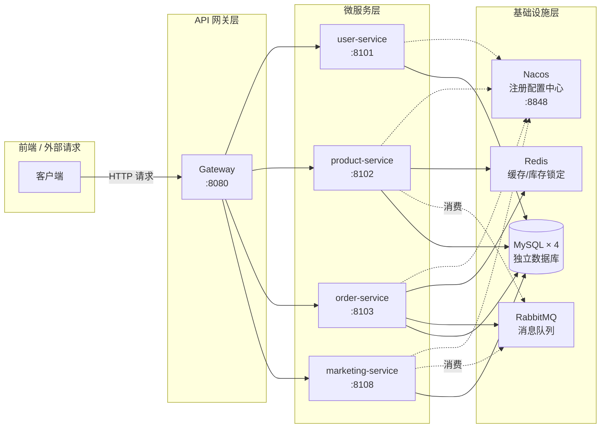
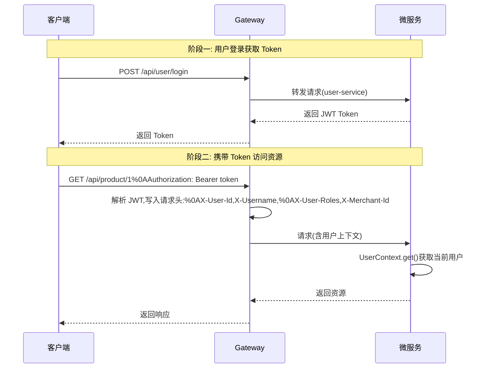
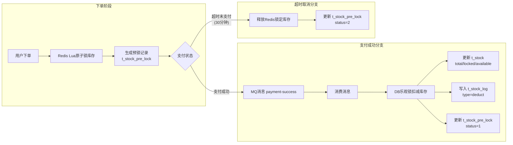

# B2C 微服务电商平台 — 后端服务

基于 Spring Cloud Alibaba 微服务架构的 B2C 电商平台后端，提供用户中心、商品管理、订单交易、营销活动等核心业务能力。

前端仓库：[E-Commerce-Platform-Frontend](https://github.com/Edgar-0919/E-Commerce-Platform-Frontend)

## 项目概述

B2C 微服务电商平台采用前后端分离架构，后端基于 Spring Cloud Alibaba 构建微服务集群，通过 Nacos 实现服务注册与配置管理，Gateway 统一入口，RabbitMQ 驱动异步消息。系统支持 C 端用户浏览购物与 B 端商户管理运营，实现完整的电商交易闭环。

**核心特性：**

- 微服务架构：4 个独立微服务，database-per-service 数据隔离
- JWT 认证：Gateway 统一鉴权，下游服务通过请求头传递用户上下文
- 商户数据隔离：MyBatis-Plus 多租户插件自动注入 `merchant_id` 过滤
- 库存扣减：Redis Lua 脚本原子操作防超卖
- 最终一致性：消息队列 + 幂等 + 死信队列兜底
- API 文档：SpringDoc OpenAPI 3 自动生成

## 技术栈

| 层 | 技术 | 版本 |
|----|------|------|
| JDK | OpenJDK | 17 |
| 框架 | Spring Boot / Spring Cloud / Spring Cloud Alibaba | 3.2.4 / 2023.0.1 / 2023.0.1.0 |
| 注册配置 | Nacos | 2.3.2 |
| 网关 | Spring Cloud Gateway | — |
| ORM | MyBatis-Plus | 3.5.9 |
| 数据库 | MySQL | 8.0 |
| 缓存 | Redis | 7.2 |
| 消息队列 | Spring Cloud Stream + RabbitMQ | 4.1.0 |
| 认证 | Spring Security + JWT | 0.12.6 |
| 服务调用 | OpenFeign + Spring Cloud LoadBalancer | — |
| 参数校验 | Jakarta Bean Validation | — |
| API 文档 | SpringDoc OpenAPI 3 | 2.3.0 |

## 项目结构

```
backend/
├── pom.xml                         # 父 POM，统一版本管理
├── common/                         # 公共模块（7 个）
│   ├── common-core/                # Result、枚举、异常、工具类
│   ├── common-security/            # JWT 工具、Security 配置
│   ├── common-web/                 # 全局异常处理、统一响应、SpringDoc
│   ├── common-mybatis/             # BaseEntity、MP 配置、多租户拦截器
│   ├── common-cache/               # Redis 序列化与缓存配置
│   ├── common-mq/                  # Spring Cloud Stream 消息抽象
│   └── common-feign/               # Feign 拦截器（传递用户上下文）
├── gateway/                        # API 网关（JWT 解析、路由转发、CORS）
├── services/                       # 微服务（4 个）
│   ├── user-service/               # 用户中心（含商户申请、商户管理）
│   ├── product-service/            # 商品服务（含库存、商品搜索）
│   ├── order-service/              # 订单服务（含支付、购物车）
│   └── marketing-service/          # 营销服务（优惠券、轮播图）
├── sql/                            # 各服务建表 SQL + 种子数据
│   ├── 01-user-service.sql         # 用户服务数据库
│   ├── 02-product-service.sql      # 商品服务数据库
│   ├── 03-order-service.sql        # 订单服务数据库
│   ├── 04-marketing-service.sql    # 营销服务数据库
│   └── 99-seed.sql                 # 测试种子数据
└── docker/                         # Docker Compose 基础设施
    └── docker-compose.yml          # MySQL、Redis、Nacos、RabbitMQ
```

## 微服务架构



### 微服务内部包结构

每个服务遵循分层架构：

```
{service}/src/main/java/com/ecommerce/{service}/
├── controller/      # REST 接口层
├── service/         # 业务接口
│   └── impl/        # 业务实现
├── mapper/          # MyBatis-Plus Mapper
├── model/
│   ├── entity/      # 数据库实体
│   ├── dto/         # 数据传输对象
│   ├── vo/          # 视图对象
│   └── converter/   # MapStruct 转换器
├── config/          # 服务级配置
└── feign/           # Feign 客户端
```

## 功能模块

| 模块 | 端口 | 功能 |
|------|------|------|
| Gateway | 8080 | JWT 解析与认证、路由转发、CORS、商户数据隔离头传递 |
| 用户中心 | 8101 | 注册登录（默认 ROLE_USER）、个人信息管理、收货地址 CRUD、商户入驻申请与审核、商户管理 |
| 商品服务 | 8102 | 商品列表/详情、分类树、品牌管理、SKU/规格管理、商品上下架、库存扣减 |
| 订单服务 | 8103 | 下单（按商户拆分订单）、订单列表/详情、取消订单（超时自动取消）、支付、购物车管理 |
| 营销服务 | 8108 | 优惠券（模板管理/领取/核销）、轮播图管理 |

## 快速开始

### 环境要求

| 工具 | 最低版本 |
|------|----------|
| JDK | 17+ |
| Maven | 3.8+ |
| Docker Desktop | 4.0+ |
| Node.js（前端） | 18+ |

### 1. 启动基础设施

```bash
cd backend/docker
docker compose up -d
```

启动后可通过以下地址访问：

| 服务 | 地址 | 账号/密码 |
|------|------|-----------|
| MySQL | localhost:3306 | root / root123 |
| Redis | localhost:6379 | — |
| Nacos | http://localhost:8848/nacos | nacos / nacos |
| RabbitMQ | http://localhost:15672 | guest / guest |

> SQL 建表脚本在容器首次启动时自动执行（`sql/` 目录挂载到 MySQL 容器的 `/docker-entrypoint-initdb.d`）。脚本按文件名排序执行：`01-` 建表 → `99-` 种子数据。

### 2. 编译项目

```bash
cd backend
mvn clean install -DskipTests
```

### 3. 启动服务

建议按以下顺序启动：

```bash
# 第一步：启动 Gateway
cd gateway
mvn spring-boot:run

# 第二步：按需启动微服务（新终端）
cd ../services/user-service
mvn spring-boot:run

# 其他服务同理
cd ../services/product-service && mvn spring-boot:run
cd ../services/order-service && mvn spring-boot:run
cd ../services/marketing-service && mvn spring-boot:run
```

### 4. 验证

各服务启动后，Nacos 控制台应能看到所有已注册服务。访问 `http://localhost:8080/api/product/page?page=1&size=10` 验证 Gateway 路由是否正常。

## 架构约定

### 认证流程



- Gateway 是唯一解析 JWT 的节点，下游服务不再重复解析
- 用户上下文通过请求头 `X-User-Id`、`X-Username`、`X-User-Roles`、`X-Merchant-Id` 传递
- 微服务内通过 `UserContext.get()` 静态方法获取当前用户信息

### 商户数据隔离

基于 MyBatis-Plus 多租户插件实现，核心规则：

- **隔离表范围**：仅对 `t_product`、`t_sku`、`t_stock`、`t_stock_log`、`t_stock_pre_lock`、`t_order`、`t_order_item`、`t_coupon_template`、`t_user_coupon` 应用商户隔离
- **管理员**：`ROLE_ADMIN` 传入 `X-Merchant-Id: ALL` 跳过租户过滤，可查看所有商户数据
- **C 端用户**：`merchantId == null` 时不隔离，允许浏览全部商品
- **特殊表**：`t_merchant_application` 跳过租户过滤，管理员可查看所有入驻申请

### 商户入驻流程

1. C 端用户在个人中心点击"成为商家"，填写商户信息并提交申请
2. 后端校验申请信息，检测是否已有待审核/已通过申请，防止重复提交
3. B 端管理员在商户管理页面查看入驻申请列表
4. 管理员审核通过：自动创建商户记录、分配 `ROLE_MERCHANT` 角色、关联用户与商户
5. 管理员审核拒绝：记录拒绝原因，用户可重新申请
6. 用户信息 API 返回商户申请状态，前端显示状态徽章

### 统一响应格式

所有 API 返回 `Result<T>` 结构：

```json
{
  "code": 200,
  "message": "操作成功",
  "data": { },
  "timestamp": 1711008000000
}
```

**错误码分段：**

| 范围 | 模块 |
|------|------|
| 200 | 成功 |
| 1xxxx | 用户模块 |
| 2xxxx | 商品模块 |
| 3xxxx | 订单模块 |
| 4xxxx | 支付模块 |
| 5xxxx | 库存模块 |

### 服务间通信

**同步调用**：OpenFeign，请求头通过 `FeignHeaderInterceptor` 自动传递用户上下文。

**异步消息**：Spring Cloud Stream + RabbitMQ，函数式编程模型（`java.util.function.Consumer`）。

| 事件 | 发送方 | 消费方 | 说明 |
|------|--------|--------|------|
| `order-created` | order-service | order-service 内部 | 下单后清除购物车选中商品 |
| `payment-success` | order-service | product-service | 支付成功后持久化扣减库存 |
| `coupon-use` | order-service | marketing-service | 优惠券核销（异步补偿） |

**消息可靠性：**
- 所有消费者均配置 `auto-bind-dlq: true` + `republish-to-dlq: true`
- 消费失败自动投递死信队列，防止消息丢失
- 关键事件（`payment-success`、`refund-success`）在事务提交后发送（`TransactionSynchronizationManager.afterCommit()`）

### 数据一致性

采用最终一致性方案：

- **订单创建**：本地事务 + Feign 同步调用，失败触发本地回滚
- **跨服务状态对齐**：消息队列重试 + 幂等校验 + 定时对账兜底
- **订单超时取消**：RabbitMQ TTL + DLX 实现 30 分钟延迟消息，超时自动取消并释放库存

### 数据库

- 每服务独立数据库（database-per-service），物理上共享同一 MySQL 实例
- 雪花算法生成分布式 ID（`IdType.ASSIGN_ID`）
- 核心表逻辑删除（`deleted` 字段）
- 库存表使用乐观锁（`version` 字段）
- 所有业务表包含 `merchant_id` 字段（NOT NULL，默认值 1 为平台自营商户）

### 库存扣减



## API 文档

各服务启动后访问 SpringDoc OpenAPI 文档：

| 服务 | Swagger UI 地址 |
|------|-----------------|
| Gateway | http://localhost:8080/swagger-ui.html |
| user-service | http://localhost:8101/swagger-ui.html |
| product-service | http://localhost:8102/swagger-ui.html |
| order-service | http://localhost:8103/swagger-ui.html |
| marketing-service | http://localhost:8108/swagger-ui.html |

### 常用 API 端点

**C 端（用户端）：**

| 方法 | 路径 | 说明 |
|------|------|------|
| POST | `/api/user/login` | 用户登录 |
| POST | `/api/user/register` | 用户注册 |
| GET | `/api/user/info` | 获取当前用户信息 |
| GET | `/api/product/page` | 商品分页列表（仅上架商品） |
| GET | `/api/product/{id}` | 商品详情 |
| POST | `/api/order` | 创建订单 |
| GET | `/api/order/page` | 订单列表 |
| POST | `/api/order/{id}/cancel` | 取消订单 |
| GET | `/api/cart/list` | 购物车列表 |
| POST | `/api/cart/add` | 添加购物车 |

**B 端（管理端）：**

| 方法 | 路径 | 说明 |
|------|------|------|
| POST | `/api/admin/login` | 管理员登录 |
| GET | `/api/admin/dashboard` | 仪表盘数据 |
| POST | `/api/admin/product` | 新增商品 |
| PUT | `/api/admin/product/{id}` | 编辑商品 |
| GET | `/api/admin/merchants/applications` | 商户入驻申请列表 |
| POST | `/api/admin/merchants/approve/{id}` | 审核通过商户申请 |
| POST | `/api/admin/merchants/reject/{id}` | 拒绝商户申请 |
